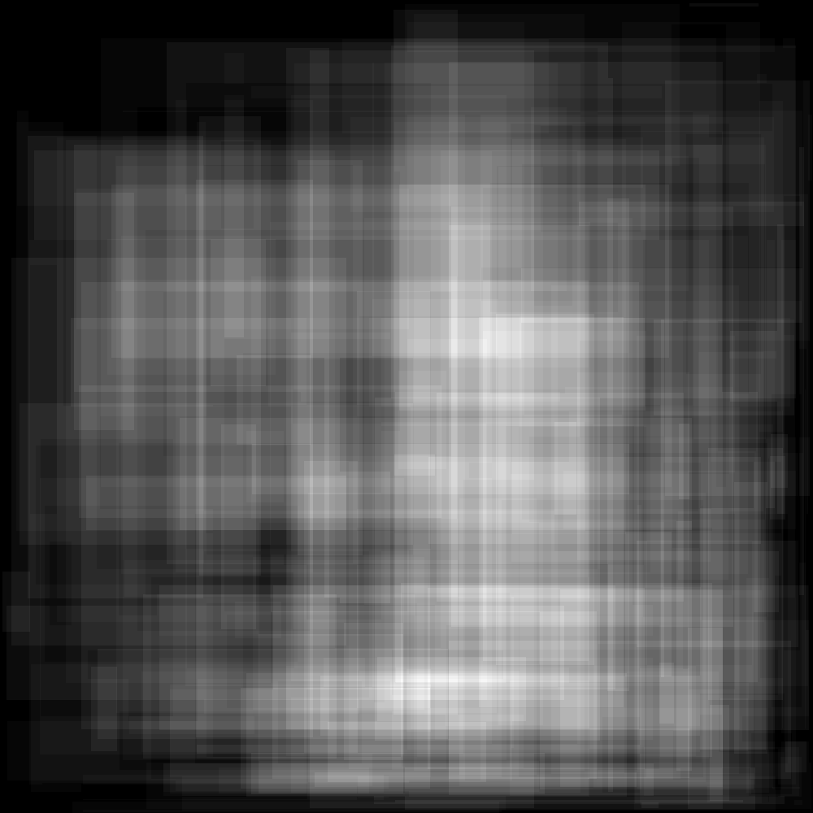
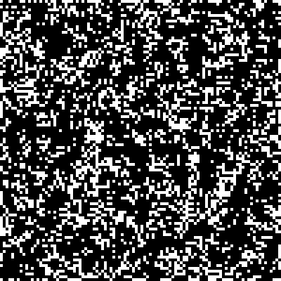

# 2015 (done in August 2026)
## Highlights

 

### Comments

Day:

6. Managed to do it the hard way so that I can solve it in 3D later (2021).
   Integrated running tests into process.
19. Less fun. The concept is challenging but the data is nice so that the solution is actually trivial. Risk of overengineering.

### Tags

Day:

1. character frequency count
2. basic arithmatic
3. surface, directions, numpy for image generation
4. hash function
5. string patterns/matching, probably should have used regex
6. regex, numpy, surface, list bound cutting
7. memoization, recursion, wires
8. arithmatic, encoding/decoding, devil in the details
9. recursion, travelling salesman problem, visit node in optimal sequence
10. recursion, string parsing
11. password odometer, character manipulation
12. json, recursion, parsing, types
13. recursion, bidirectional relations, round table
14. modulo, scoring, race
15. calories, equation, compromise
16. contents matching
17. combinations
18. cellular automata, lights, neighbourhood
19. string concatenations, permutations, recursion
20. permutations, factors, brute force

### Errors that cost time

- Day 04: Matching two strings of different lengths: line[0:6] == "00000"
- Day 06: Focusing on wrong section of problem due to large data set - use smaller tests!
- Day 13: Used wrong list when retrieving indices. Took a while to find the problem
- Day 17: When doing combinations, remember that we need to sometimes do nothing for a recursion.
