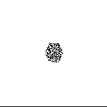
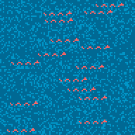

# Advent of Code
My [Advent of Code](https://adventofcode.com/) solutions

Starting a new year? Create all the directories for each day with `mkdir day{01..25}`.

## 2021
### Highlights

### Comments

* Day 05: There must be an easier way to determine coordinates between two diagonal points.
* Day 06: First part is programmed simply conceptually but is inefficient - particular given that it's modeling exponential growth. Need to consider computational efficiency from the start next time.
* Day 07: Need to consider the statistical properties of distributions and what's being asked rather than reimplement existing operations (i.e., mean and median).
* Day 08: What a beast. A bloated beast of nested loops trying to create the logic equivalent of solving a sodoku.
* Day 09: Over-engineered.

### Tags
I note some consepts that are required to solve the chalenges for each day.
If I need to reapply I can find code bits.

Day:

1. diff, lag, filter
2. path finding
3. recursion, matrices
4. classes, matrices
5. mapping, matrices
6. efficiency
7. statistics
8. logic, sodoku-solving-like, classes
9. cellular automata, matrices
10. stack

## 2020
### Highlights

### Comments
They're not all necessarily efficient solutions.

The trickiest days/problems for me were based on efficiency problems. While I could solve the test sets, the problem set took too long to run:

* Day 25: Cracking encryption - Needed to populate array once with sequential transforms once rather than testing possible loop values against public key.
* Day 23: Cups reorganization - Rather than use an array and making changes, I needed to use a linked-list data structure comprised of a hash/dict that simply pointed to next cup. Each turn then only had a remove and insert update rather than searching and updating the array.
* Day 19: Missed logic catch - Detected junk at the end of a string but counting logic flow didn't catch it. Took a long time to find error. 
