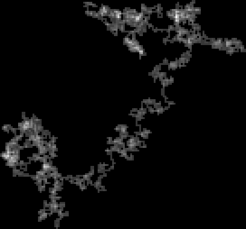
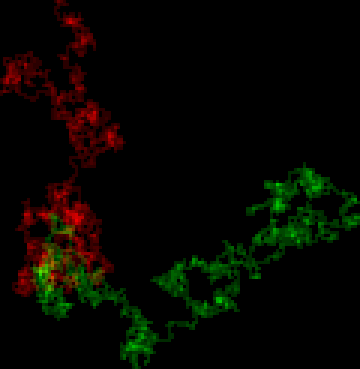
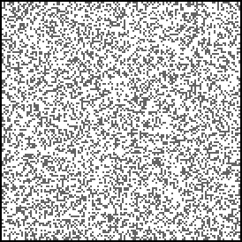
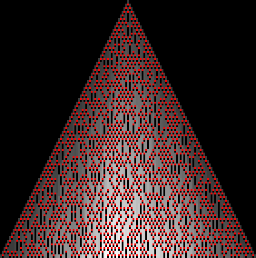
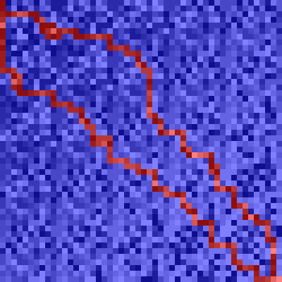
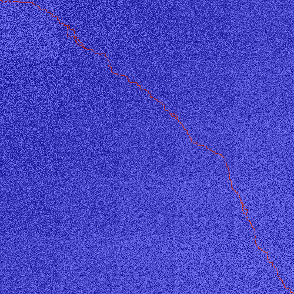
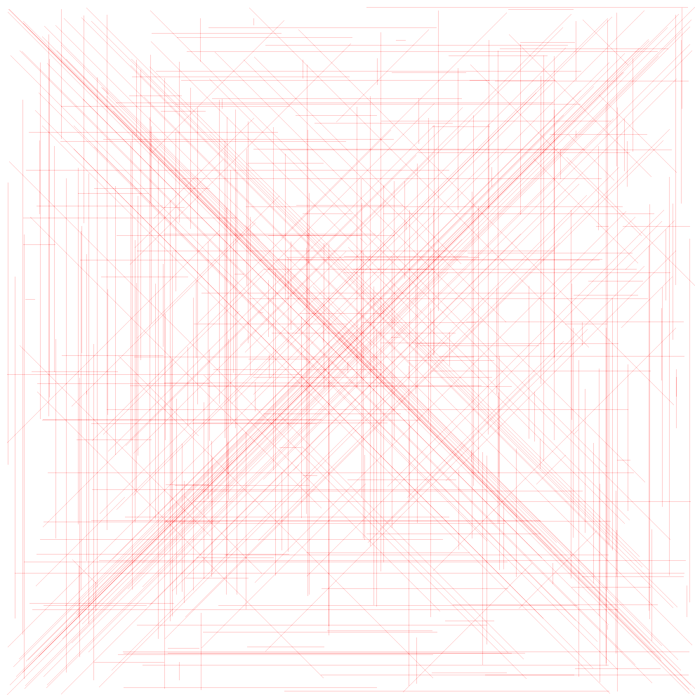
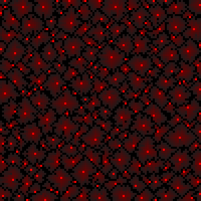
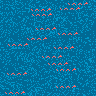

# Advent of Code
My [Advent of Code](https://adventofcode.com/) solutions

[2020](/2020)
[2021](/2021)
[2022](/2022)
[2023](/2023)
[2024](/2024)
[2025](/2025)

## Highlights

### 2015 (in August 2026)

### 2025

### 2023

### 2021

### 2020

## Tips for me

### Create animated gifs
Use terminal:

    convert -delay 10 -loop 0 *.png anim.gif

The 0 means infinite.

### Create all my day folders

Starting a new year?  
Create all the directories for each day with:

    mkdir day{01..25}

### Using VE

Using virtual environment and package now:

Create the VE:

    python -m venv venv

Activate VE: 

    . venv/bin/activate

Install local and active project:

    pip install -e . (path to package to install)

I will likely need install other dependencies that are not present in VE:

    pip install numpy

Deactivate VE:

    deactivate
