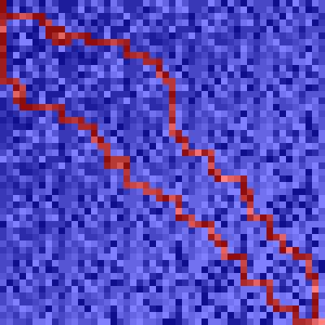
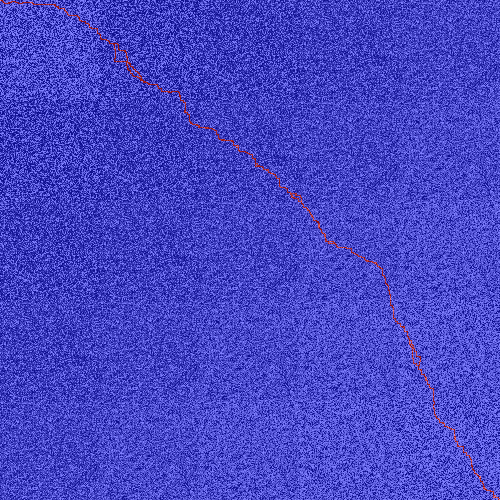
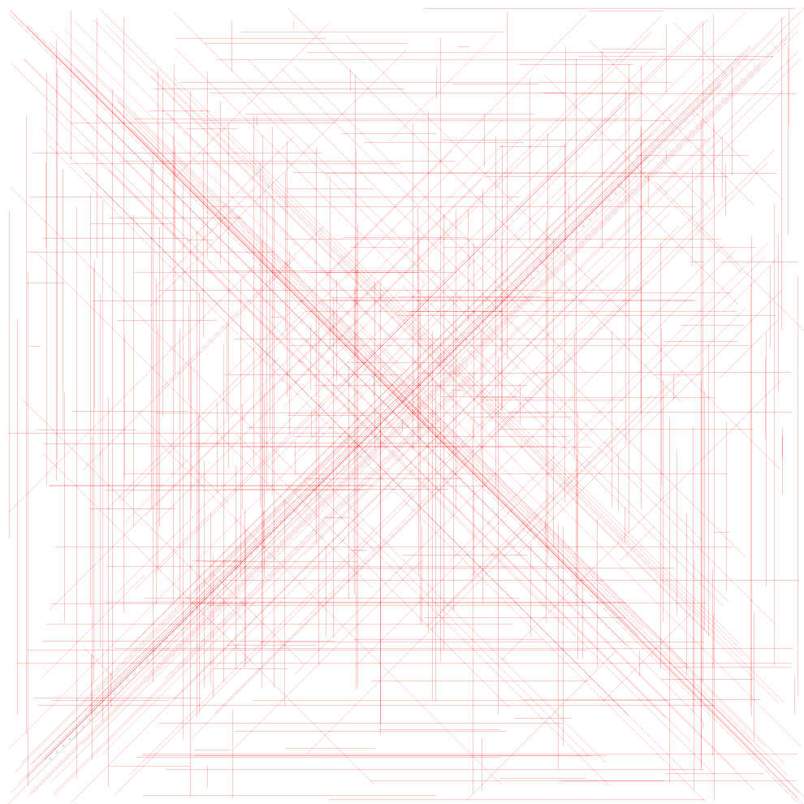

# Advent of Code
My [Advent of Code](https://adventofcode.com/) solutions

[2020](/2020)
[2021](/2021)
[2022](/2022)
[2023](/2023)
[2024](/2024)

## Highlights
### 2021

### 2020

## Tips for me

### Create animated gifs
Use terminal:

    convert -delay 10 -loop 0 *.png anim.gif

The 0 means infinite.

### Create all my day folders

Starting a new year?  
Create all the directories for each day with:

    mkdir day{01..25}
