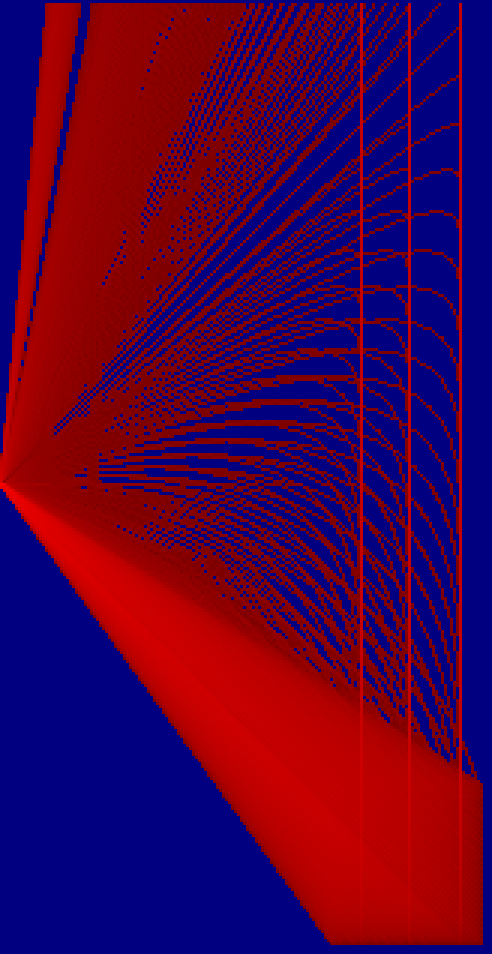

# Advent of Code
My [Advent of Code](https://adventofcode.com/) solutions

Starting a new year? Create all the directories for each day with `mkdir day{01..25}`.

## 2021
### Highlights


### Comments

2. did it dirty - can optimize with modulo
3. `ord()` provides the integer of (Unicode) character 

### Tricky problems
### Tags

1. array subsetting
2. modulo
3. character encoding, dictionary
4. range expansion

## 2021
### Highlights



Matrix folding of transparent sheet to produce the following:
```
.##....##..##..#..#.###...##..###..###..
#..#....#.#..#.#.#..#..#.#..#.#..#.#..#.
#.......#.#....##...###..#..#.#..#.###..
#.......#.#....#.#..#..#.####.###..#..#.
#..#.#..#.#..#.#.#..#..#.#..#.#....#..#.
.##...##...##..#..#.###..#..#.#....###..
```

### Comments

* Day 05: There must be an easier way to determine coordinates between two diagonal points.
* Day 06: First part is programmed simply conceptually but is inefficient - particular given that it's modeling exponential growth. Need to consider computational efficiency from the start next time.
* Day 07: Need to consider the statistical properties of distributions and what's being asked rather than reimplement existing operations (i.e., mean and median).
* Day 08: What a beast. A bloated beast of nested loops trying to create the logic equivalent of solving a sodoku.
* Day 09: Over-engineered.
* Day 12: Bind bending at first - recursion usually is.
* Day 13: Bug in input I believe - asymmetric fold.
* Day 14: Required alternative thinking, flipping the task backwards. Building a dict of all possibilities back up. Then selecting the appropriate items. Also, I need to be more careful when using lists as they pass by reference and not value.
* Day 16: Quite a nice recursive calculator. Too much reading to figure out the requirements.

### Tricky problems

* Day 08: A grind, but not as hard as Day 14. 
* Day 14: Need to carefully work the problem out from the reverse direction.
* Day 15: Careful, your path doesn't go only down and right.
* Day 18: Tried to use recursion. That failed. Restarted but with a tree. Better but painful.

### Tags
Concepts used or required to solve the challenges:

Day:

1. diff, lag, filter
2. path finding
3. recursion, matrices
4. classes, matrices
5. mapping, matrices
6. efficiency
7. statistics
8. logic, sodoku-solving-like, classes
9. cellular automata, matrices
10. stack
11. cellular automata, matrices
12. recursion
13. matrices, folding
14. optimization, efficiency
15. mapping, matrices, routing efficiency
16. RTFM, recursion
17. geometry, trajectory
18. tree, classes
19. 3D rotation, matrices
20. matrices, filter, binary, cellular automata

## 2020
### Highlights


### Comments
They're not all necessarily efficient solutions.

The trickiest days/problems for me were based on efficiency problems. While I could solve the test sets, the problem set took too long to run:

* Day 25: Cracking encryption - Needed to populate array once with sequential transforms once rather than testing possible loop values against public key.
* Day 23: Cups reorganization - Rather than use an array and making changes, I needed to use a linked-list data structure comprised of a hash/dict that simply pointed to next cup. Each turn then only had a remove and insert update rather than searching and updating the array.
* Day 19: Missed logic catch - Detected junk at the end of a string but counting logic flow didn't catch it. Took a long time to find error. 
